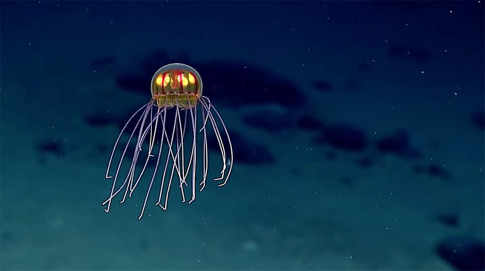

# 1 Project Instructions
- **Jellyfishes will move randomly by themselves**

## 2 Details of my individual approach
- I chosed **Perline noise** and **random value**
- There are two preperties that will be animated
    - The grass
        - The grass will move like a jellyfish.
            
            (Skye: grass will change its shape and colour according to music level)

            (Winston: mouse press the grass to grab it moving around)
    - The dots
        - Those dots on the back will randomly grow or shrink
        (other members didn't animate this part)
- Inspirations
    > **Inspirations of the background**
    - According to the group’s drawings, the twisted lines and multi-colored dots in the background made me suddenly feel like I was in a hallucination, so I looked for some dynamic works that looked more psychedelic, and then I found this of a video.
    [Extremely psychedelic trip](https://www.bilibili.com/video/BV1Jx411t73e/?spm_id_from=333.788.recommend_more_video.0&vd_source=f4b5e4083ae34344adca09137a0caeeb)
    In this video, there are a lot of flowing lines and shapes that fit the theme I was hoping to fit.
    

        Among them, the effect of this part gave me the inspiration to deal with the dots in the background. The centers of these circles expand and contract, just like the breathing of life and the evolution of stars.
    > **Inspirations of the grass**
    - The grass in the painting has a lot of spiral curves, which reminds me of marine life. If the grass is dragging lines like marine life and swimming in the painting, with a dreamlike scenery behind it, it will be very A psychedelic sight.

        In the end, I chose jellyfish. The jellyfish moves erratically in the water, and it has a dreamlike shape. The long tentacles are very similar to the grass in the group painting, which makes me think that jellyfish are very suitable to be the target of the changes in the grass.
    

        Emily's drawings show grass and seeds on the ground, and my animations bring them to life.

- Technical Explanation

   - In order to let the grass look like jellyfish and start moving, the original coding method for drawing grass is no longer suitable for jellyfish, so I changed the way of drawing jellyfish. By defining multiple class categories, I finally combined them into jellyfish and gave them the logic of movement. At the same time, because the dots in the background need to expand, deform, and change color independently, I turned the three types of dots into one and created classes for them.
    - I used easing function method that come from internet, which is the penner class part of my code. Those easing function method is from [Easing](https://easings.net/#) and [CSDN](https://blog.csdn.net/qq_40765480/article/details/127551512)